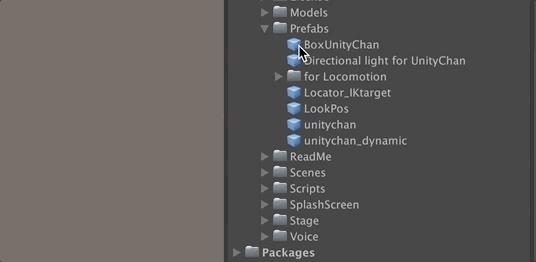

# AssetDependencyTree
Unity Asset dependency tree viewer

## Feature
* Show Asset Dependencies in TreeView
* Filter Asset Dependencies

## Usage
1. Select target assets.
2. Click MenuItem "Select Dependencies(Tree View)"

## Licence

[MIT](LICENSE)
© UTJ/UCL

## Author

[Syy9](https://github.com/Syy9)
